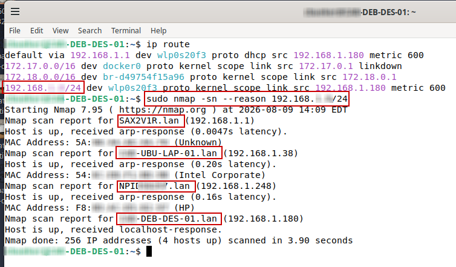
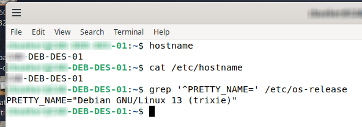
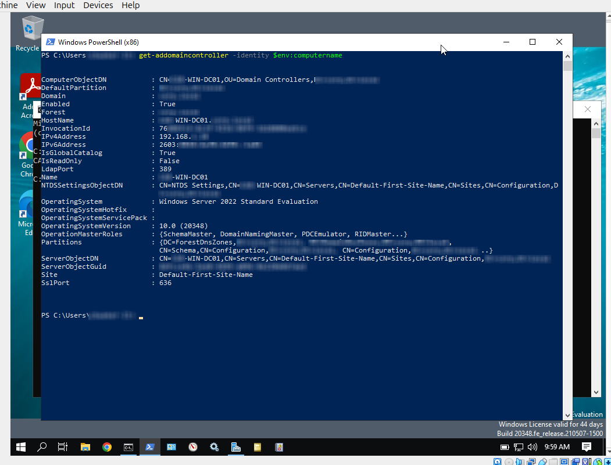
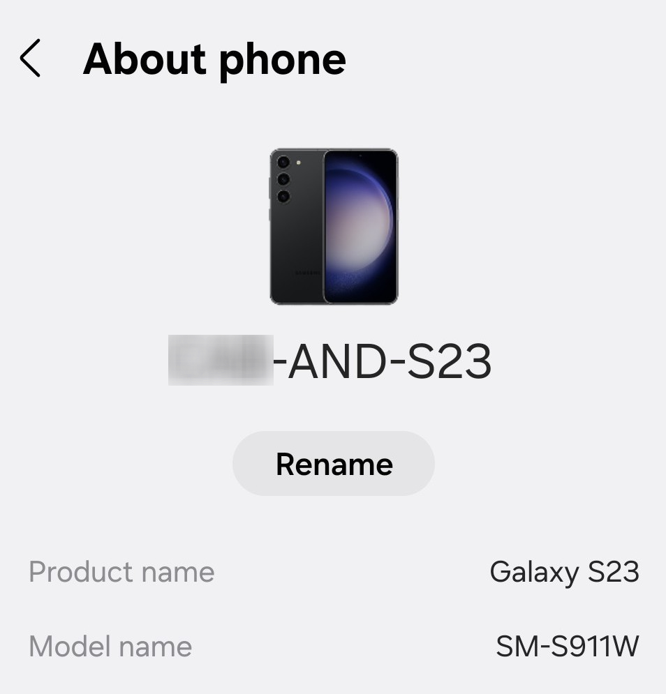
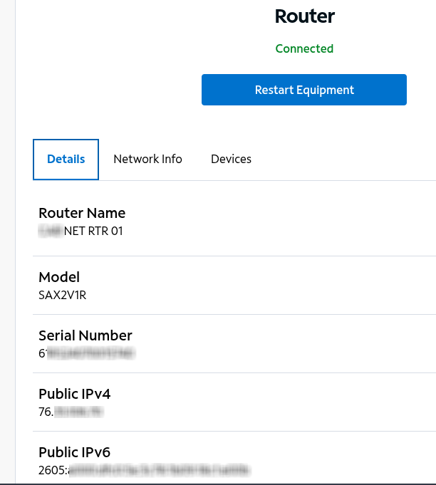

**Device Hostname Naming Standardization**

Lab documenting a consistent device and hostname naming standard across IT systems.

## Spectrum Device Inventory

- Shows a consistent naming approach across desktop, mobile, printer, and laptop devices.
- Demonstrates how platform and device-type identifiers make systems easier to recognize in a centralized device inventory.
- Shows how standardized device names can support faster identification during troubleshooting and administration.

## Network Discovery with Nmap

- Identifies the local `192.168.1.0/24` subnet used for host discovery.
- Uses Nmap to identify active devices on the local network.
- Shows a manufacturer/default-style hostname such as `SAX2V1R.lan`.
- Shows intentionally structured hostnames such as the Ubuntu and Debian systems.
- Demonstrates that network discovery can identify active systems without necessarily providing a consistent administrative naming standard.

## Debian Hostname Validation

- Verifies the configured Debian hostname directly from the operating system.
- Confirms that the persistent hostname matches the intended device naming structure.
- Confirms the system platform as Debian GNU/Linux 13, supporting the `DEB` identifier used in the hostname.

## Windows Server Domain Controller Naming

- Identifies the Windows Server system using a structured computer name containing the Windows platform and domain controller role.
- Confirms the system is running Windows Server 2022.
- Confirms the server is functioning as an Active Directory Global Catalog.
- Shows Active Directory operations-master roles, demonstrating that the naming approach also applies to infrastructure systems with defined administrative responsibilities.

## Android Device Naming

- Shows an intentionally assigned Android device name using the same general naming approach.
- Confirms the device as a Galaxy S23, supporting the Android identifier used in the administrative name.
- Demonstrates that the naming standard can extend beyond traditional computers to mobile endpoints.

## Router Device Naming

- Shows an intentionally assigned administrative name identifying the device as a network router.
- Separates the router's administrative identity from its hardware model information.
- Demonstrates how network infrastructure can be incorporated into the same broader device naming standard.

