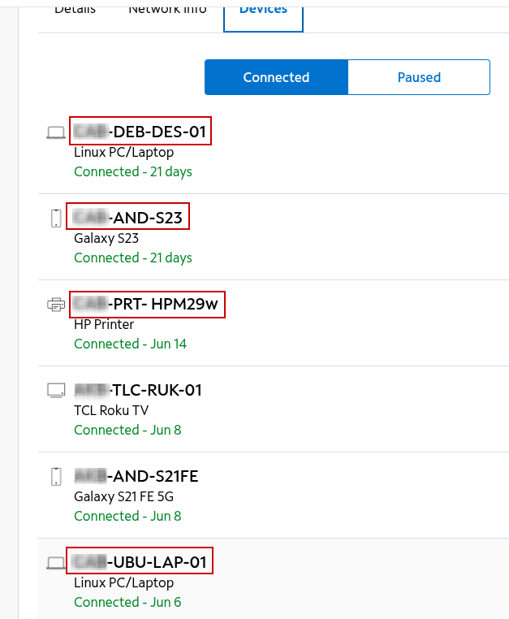
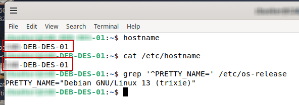
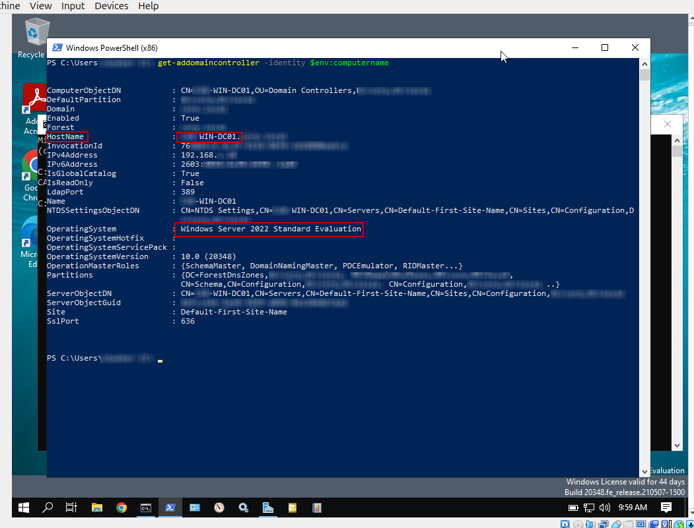
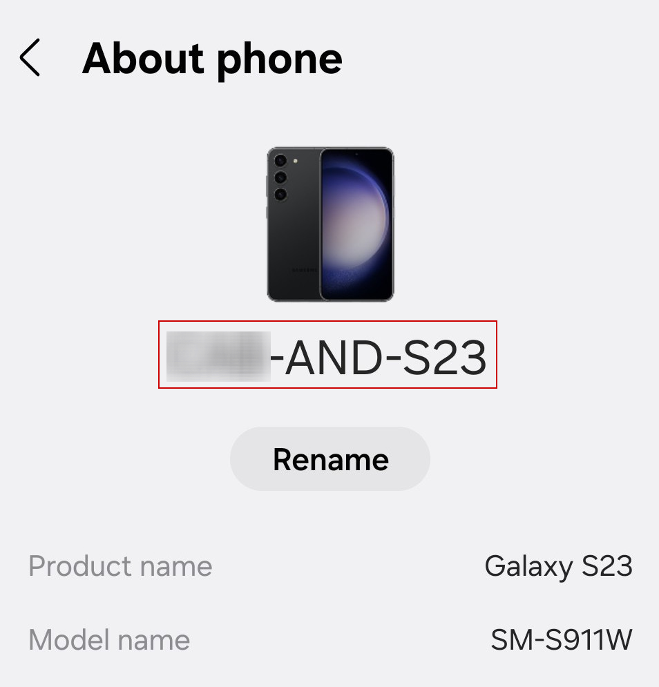
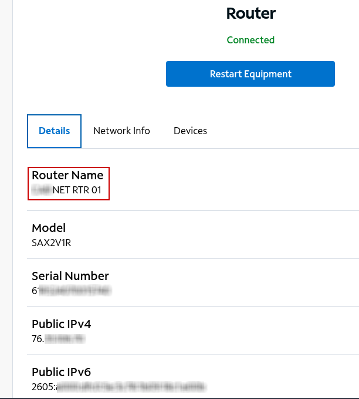

**Device Hostname Naming Standardization**

Lab documenting a consistent device and hostname naming standard across IT systems.

The naming structure used for hostnames and devices most likely vary between businesses and organizations. Some environments may use location, department, site, platform, device type, role, or other identifiers. The main goal when creating a naming standard is that it is consistent, easy to understand, easy to identify, and useful to the administrators and people responsible for managing the systems.

A standardized hostname does not replace a formal asset inventory, monitoring platform, or configuration management system. Instead, the goal is to provide a reliable and standardized method of device identification that can be referenced across different systems. This can improve troubleshooting, monitoring, ticketing, documentation, and the overall administration of IT systems.

Objective
- Create a consistent device and hostname naming standard.
- Apply the standard across different types of IT systems.
- Compare intentional device names with network-discovery results.
- Make devices easier to identify during troubleshooting and administration.
- Document a naming approach that can scale to larger environments.

**Naming Format**

The naming structure I use as an example in this lab is just that—an example. It is not a universal standard. Each small business or organization should develop a naming convention that reflects the needs of the business, its environment, locations, administrative structure, and operational requirements. The main thing to keep in mind is that the standard remains consistent, understandable, scalable, and useful to the people responsible for administering and managing the systems.

`OWNER/DEPARTMENT` – `PLATFORM` – `TYPE/ROLE` – `SEQUENCE`

Each section of the name provides useful information about the system.

`OWNER/DEPARTMENT`: Identifies the person, department, group, or administrative owner responsible for the device.

`PLATFORM`: Identifies the operating system or general technology platform.

`TYPE/ROLE`: Identifies what the device is or what function it performs.

`SEQUENCE`: Provides a unique number when multiple devices use the same general classification.

For example:

`FIN-WIN-LAP-01`

could represent:

- `FIN` — Finance
- `WIN` — Windows
- `LAP` — Laptop
- `01` — First device in that category

Another example:

`ITS-WIN-DC-01`

could represent:

- `ITS` — Information Technology Services
- `WIN` — Windows
- `DC` — Domain Controller
- `01` — First domain controller in that naming group

For network infrastructure:

`FAM-NET-RTR-01`

could represent:

- `FAM` — Family infrastructure
- `NET` — Network device
- `RTR` — Router
- `01` — First router in that category

**Naming Standard Design Principles**

- **Consistency**: Devices should follow the same documented naming structure throughout the environment.
- **Clarity**: Names should be easy for administrators and support personnel to understand and identify.
- **Uniqueness**: Each managed device should have a distinct name that prevents confusion with other systems.
- **Stability**: Naming fields should use information that is unlikely to change frequently.
- **Scalability**: The standard should allow additional devices, locations, and system types to be added as the environment grows.
- **Relevance**: Each part of the name should provide useful administrative information rather than adding unnecessary detail.
- **Compatibility**: Names should remain reasonably short and use characters and structures that work reliably across operating systems and management platforms.

**Location and Site Identifiers**

Larger organizations may also include a location or site identifier in the naming standard they choose for the business. This can be especially helpful when an organization operates across multiple cities, states, offices, or countries because the device name can immediately provide some context about where the system belongs.

For example:

`CIN-WIN-LAP-01`

could represent:

- `CIN` — Cincinnati site
- `WIN` — Windows
- `LAP` — Laptop
- `01` — First laptop in that category

A larger environment could also use a state or regional identifier, such as:

`OH-CIN-WIN-LAP-01`

However, more information does not always make a hostname better. Device names should remain readable and reasonably short. In many environments, a short site code such as `CIN` may provide enough location information, while the full address, state, building, floor, and asset details are maintained in the asset inventory or configuration management system.

**Spectrum Device Inventory**

- Highlights structured names across Linux, Android, printer, and laptop devices.
- Uses short platform and device-type identifiers such as DEB, AND, PRT, UBU, DES, and LAP.
- Demonstrates how one naming approach can make different types of devices easier to identify within a centralized inventory.

**Network Discovery with Nmap**

- Identifies the local 192.168.1.0/24 subnet and uses Nmap to discover active hosts.
- Shows intentionally structured hostnames for the Ubuntu and Debian systems.
- Also returns provider or manufacturer-style names such as SAX2V1R.lan and NPI...lan.
- Demonstrates that network discovery can identify reachable systems without guaranteeing a consistent administrative naming standard.

**Debian Hostname Validation**

- Confirms the same structured hostname through both hostname and /etc/hostname.
- Verifies that the device name is configured persistently at the operating-system level.
- Confirms Debian GNU/Linux 13 as the platform represented by the DEB identifier.

**Windows Server Domain Controller Naming**

- Confirms a structured Windows Server hostname that identifies both the Windows platform and domain controller role.
- Verifies the system is running Windows Server 2022.
- Demonstrates that the same naming approach can be applied to infrastructure systems as well as user endpoints.

**Android Device Naming**

- Shows an intentionally configured Android device name using the same general naming structure.
- Uses AND to identify the Android platform while retaining the device model separately.
- Demonstrates that the standard can extend beyond traditional computers to mobile endpoints.

**Router Device Naming**

- Shows an intentionally assigned administrative name identifying the device as a network router.
- Uses NET and RTR to describe the device category and role.
- Demonstrates that network infrastructure can be included in the same broader naming standard.

**Lessons Learned**
- Network discovery does not always return a useful or consistent device name.
- A naming standard gives administrators a predictable way to identify systems.
- Device names should be simple, readable, consistent, and scalable.
- Hardware details and device names serve different purposes.
- Naming standards can be adapted to different platforms and device types.
- Existing systems should not be renamed without considering the impact of the change.

**Business Impact**

A consistent and reliable device and hostname naming standard gives systems administrators a common way to identify systems and devices across various IT platforms. When a device appears in a monitoring alert, support ticket, asset inventory, directory service, or another administrative system, a predictable name makes it much easier to identify the correct device, understand its role, and troubleshoot from there.

This can reduce confusion and friction, help standardize troubleshooting, and improve incident response, especially when multiple systems and administrative tools need to be checked before a problem can be fully understood. The naming standard does not replace the information stored in those systems, but it provides a reliable point of reference that helps administrators gather information, connect the different systems together, and troubleshoot more efficiently.

**Skills Demonstrated**

- Device and hostname standardization
- Windows and Linux systems administration
- Network discovery and subnet identification
- Active Directory infrastructure review
- Endpoint and network-device identification
- Asset management and inventory concepts
- Technical documentation and evidence sanitization

**Summary**

I used this project as an opportunity to document how consistent device and hostname naming standards can be used across various IT systems. I reviewed devices through a centralized device inventory, compared those names with network-discovery results, and used my Debian system, Windows Server environment, Android device, and network infrastructure to demonstrate how device names can be intentionally configured and validated across different platforms.

This project also demonstrated that network discovery does not always provide the same level of reliable device identification as a naming standard intentionally designed by the systems administrator. A consistent and reliable naming structure gives administrators a clearer way to identify devices while troubleshooting, monitoring, documenting, and managing the environment.

The exact naming structure will vary between businesses because each environment has different needs. The main principle remains the same: device names should be consistent, clear, useful, and intentionally designed around the needs of the business and the people responsible for administering the IT environment.

Navigation

[`Back to GitHub Profile`](https://www.github.com/cbueker-it)

